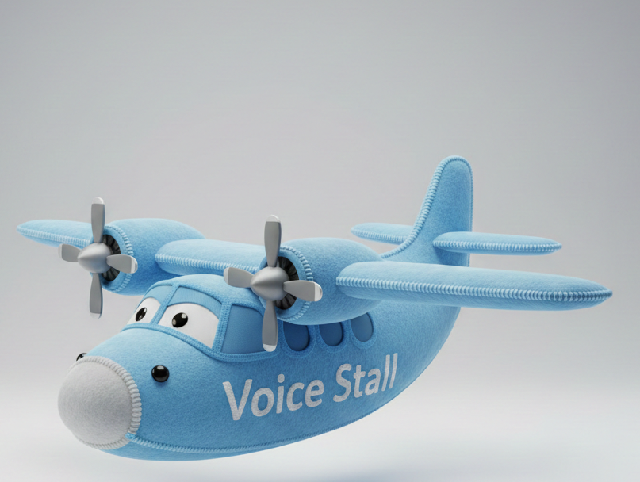

# Voice Stall

<p align="center">
  
</p>

Aplicación local de dictado para Windows con `faster-whisper`, hotkey global y pegado automático.

## Estado del proyecto

- Rama canónica: `version-2.0`
- App principal (v2): `main_qt.py` (PySide6)
- Migración en curso: `tauri-app/` (Tauri + React + sidecar Python)

## Requisitos

- Windows 10/11
- Python `>=3.12`
- `uv` en `PATH`
- GPU NVIDIA + CUDA recomendada (fallback automático a CPU `int8`)

## Instalación

```powershell
uv sync
```

## Ejecutar v2 (principal)

```powershell
uv run main_qt.py
```

Opcional:

```powershell
.\start_voz_qt.cmd
.\start_voz_qt_silent.vbs
.\crear_acceso_directo_v2.ps1
```

## Ejecutar Tauri (migración)

Requisitos adicionales:
- Node.js 20+
- Rust toolchain (stable) con target Windows

```powershell
cd tauri-app
npm install
npm run tauri dev
```

Backend sidecar:
- `python_backend.py` (protocolo JSON por `stdin/stdout`)
- Reusa `engine.py`, `recorder.py`, `dictation_service.py` y `app_storage.py`

## Configuración

- Plantilla versionada: `config.default.json`
- Configuración local (no versionada): `config.json`

Al arrancar la app, si `config.json` no existe, se genera automáticamente usando la plantilla.

## Tests

```powershell
uv run python -m pytest -q
```

## Benchmark local

```powershell
uv run python benchmarks/run_benchmark.py --iterations 2000
```

Salida:
- `benchmarks/benchmark_latest.json`
- `benchmarks/benchmark_latest.md`

## Estructura

- `main_qt.py`: UI principal, hotkey, historial, diagnóstico, pegado
- `python_backend.py`: sidecar Python persistente para Tauri
- `tauri-app/`: shell Tauri (Rust) + frontend React/TypeScript
- `dictation_service.py`: orquestación de ciclo de dictado
- `app_storage.py`: configuración, historial y logs de timing
- `engine.py`: STT, perfiles, prompt y diccionario
- `recorder.py`: captura de audio y WAV temporal
- `tests/`: tests unitarios

## Alcance actual

- El dictado se procesa en una sola pasada STT + diccionario + pegado.
- No hay comandos por voz para abrir aplicaciones/sitios (por ejemplo `abre ...`).
- No hay refinado posterior con LLM/Ollama.

## Privacidad

- Audio y texto se procesan localmente.
- `temp_audio.wav` se borra tras procesar.
- Historial y métricas se guardan en local.

## Evaluación de framework

- Ver: `docs/framework_evaluation_2026-02-27.md`
